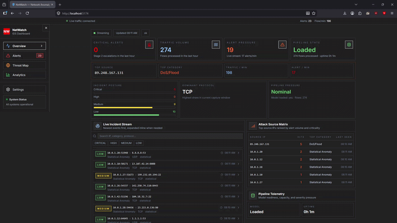

# NetWatch — Network Anomaly Detection & Intrusion Detection System

A two-stage network intrusion detection system combining statistical baselining with ML anomaly scoring, live WebSocket streaming, IP threat intelligence enrichment, and a Prometheus/Grafana observability stack — built around real packet capture and the CIC-IDS-2018 benchmark dataset.



## Architecture

## How It Works

### Stage 1 — Statistical Baseline Detection

Each incoming network flow is represented as a 20-dimensional feature vector (byte counts, packet rates, inter-arrival times, TCP flag distributions). A rolling window of the last 1,000 flows maintains per-feature mean and standard deviation. Any flow with features deviating more than 3.5 standard deviations from the baseline is flagged. This catches volume-based attacks (port scans, SYN floods, DoS) immediately with zero training data.

### Stage 2 — ML Classifier

Two models trained on the CIC-IDS-2018 dataset:

- **Isolation Forest** (unsupervised): Trained on benign traffic only. Models how easily a point can be isolated from the cluster of normal behaviour — anomalies are easy to isolate. Score below `IF_THRESHOLD` triggers a flag.
- **Random Forest** (supervised): Trained on all 14 labelled attack categories. Provides specific attack classification for known signatures. Low-confidence predictions (below `RF_CONFIDENCE_THRESHOLD`) are suppressed to reduce false positives.

The two stages are complementary: Stage 1 catches volume anomalies instantly; Stage 2 catches pattern-based attacks that look normal by volume (slow scans, brute force, C2 beaconing).

### Alert Rate Limiting

Duplicate alerts for the same `(src_ip, category)` pair are suppressed within a configurable time window (`ALERT_RATE_LIMIT_SECONDS`). The suppressor table is bounded to 5,000 entries with LRU eviction.

### IP Threat Intelligence

When an alert detail modal is opened, NetWatch enriches the source IP in real time:
- **GeoIP** via ip-api.com (no API key required): country, region, city, ISP, org, ASN
- **AbuseIPDB** (optional, set `ABUSEIPDB_API_KEY`): abuse confidence score (0–100%), report count, Tor exit node flag
- Results cached in-memory for 1 hour; private/RFC-1918 addresses are skipped

### Observability

- **Prometheus** scrapes `/metrics` every 10 seconds
- **Grafana** ships a pre-provisioned NetWatch dashboard with auto-refresh every 10 s:
  - Flows/sec, alerts/min, rate-limited count, ML loaded status, active WS connections
  - Timeseries: flows by protocol, alerts by severity
  - Percentile latency (p50 / p95 / p99)
  - Pie charts: by detection stage, by severity, by attack category

## Tech Stack

| Layer | Technology | Why |
|---|---|---|
| Packet capture | Scapy + libpcap | Scriptable, cross-platform, IPv4/IPv6 support |
| Flow engine | Python + NumPy | Full control over feature extraction |
| Stage 1 | Statistical (z-score) | Fast, explainable, no training needed |
| Stage 2 | scikit-learn (IF + RF) | Standard, well-understood, exportable |
| Dataset | CIC-IDS-2018 | Academic standard for IDS research |
| Alert store | SQLite (WAL mode) | Zero-dependency, portable, fast writes |
| Backend | FastAPI | Async, WebSocket-native |
| Real-time push | WebSocket | Low-latency alert streaming |
| Threat intel | ip-api.com + AbuseIPDB | GeoIP enrichment, no required key |
| Observability | Prometheus + Grafana | Industry standard, pre-provisioned |
| Frontend | React + TypeScript + Vite | Live dashboard with Recharts |
| Containers | Docker + docker-compose | One command to run everything |
| Tests | pytest + pytest-asyncio | 50 tests covering pipeline, models, API |

## Cloud-Native Deployment (Terraform + Kubernetes + Helm)

NetWatch now includes an infrastructure stack for AWS and Kubernetes:

- Terraform provisions VPC, EKS, and ECR repositories
- Helm deploys backend, capture, and frontend workloads to the cluster
- Baseline Kubernetes hardening manifests (network policies, PDBs) are included

### Infrastructure Layout

- `infra/terraform`: AWS infrastructure + optional Helm release
- `infra/terraform/environments`: environment-specific tfvars
- `infra/helm/netwatch`: Helm chart for app deployment
- `infra/k8s/base`: baseline Kubernetes governance manifests

### Prerequisites

- Terraform >= 1.7
- AWS credentials configured (`aws configure`)
- kubectl
- Helm >= 3

### Provision AWS + EKS + ECR (Dev)

```bash
cd infra/terraform
terraform init
terraform plan -var-file=environments/dev.tfvars
terraform apply -var-file=environments/dev.tfvars
```

After apply, configure kubectl:

```bash
aws eks update-kubeconfig \
  --region eu-central-1 \
  --name netwatch-dev
```

### Deploy with Helm

If `enable_helm_release=true`, Terraform deploys Helm automatically.

To deploy or upgrade manually:

```bash
helm upgrade --install netwatch ./infra/helm/netwatch \
  --namespace netwatch \
  --create-namespace
```

### Apply Baseline Policies

```bash
kubectl apply -f infra/k8s/base/namespace.yaml
kubectl apply -f infra/k8s/base/network-policy.yaml
kubectl apply -f infra/k8s/base/pod-disruption-budget.yaml
```

### Destroy Environment

```bash
cd infra/terraform
terraform destroy -var-file=environments/dev.tfvars
```

## Single-Node EC2 Deployment (Free Tier)

For a low-cost deployment on a single AWS EC2 instance (e.g., `t2.micro`), see the [EC2 Deployment Guide](docs/deployment_ec2.md). This setup uses Docker Compose and includes instructions for configuring Swap space to handle the 1GB RAM limitation of Free Tier instances.

## Quick Start — Demo Mode

```bash
# 1. Clone and configure
cp .env.example .env

# 2. Start all services (backend, capture, frontend, prometheus, grafana)
docker compose up --build

# 3. Open the dashboard
open http://localhost:5174

# 4. Open Grafana (admin / netwatch)
open http://localhost:3000
```

The demo mode generates synthetic benign traffic (~50 flows/min) with periodic injected attacks (port scans, SYN floods, SSH brute force, DNS floods) — no root privileges or live network needed.

## Quick Start — Live Capture Mode

```bash
# 1. Configure for live capture
cp .env.example .env
# Edit .env: set DEMO_MODE=false, INTERFACE=<your_interface>

# 2. Start (capture service requires NET_ADMIN for raw sockets)
docker compose up --build

# 3. Open the dashboard
open http://localhost:5174
```

## Quick Start — PCAP Replay Mode

Replay recorded `.pcap` / `.pcapng` files through the full detection pipeline:

```bash
# 1. Configure
cp .env.example .env
# Edit .env:
#   DEMO_MODE=false
#   REPLAY_PCAP=/data/your-capture.pcap
#   REPLAY_SPEED=10.0    (10x real-time speed; 0 = as fast as possible)
#   REPLAY_LOOP=true     (loop for continuous demo)

# 2. Mount your PCAP into the capture container in docker-compose.yml:
# volumes:
#   - ./your-capture.pcap:/data/your-capture.pcap

# 3. Start
docker compose up --build
```

PCAP replay honours real inter-packet timing (scaled by `REPLAY_SPEED`) so the detection pipeline sees realistic flow durations and inter-arrival statistics.

## Training the ML Models

The ML stage is optional — the system operates with statistical detection alone when models are absent. To enable ML classification:

```bash
# 1. Download CIC-IDS-2018 (see data/README.md for instructions)
#    Place CSV files in the data/ directory

# 2. Train models
cd backend
pip install -r requirements.txt
python3 -m ml.train

# 3. Evaluate
python3 -m ml.evaluate

# 4. Models are saved to backend/ml/models/ and loaded automatically on startup
```

## Running Tests

```bash
cd backend
pip install pytest pytest-asyncio httpx
python3 -m pytest tests/ -v
```

50 tests across 6 files:

| File | What it covers |
|---|---|
| `test_stage1.py` | Rolling baseline z-score detection, warmup, severity thresholds, anomaly classification |
| `test_stage2.py` | ML classifier loading, prediction, confidence gating, class→severity mapping |
| `test_severity.py` | Severity combination logic, stage merging, Unknown Anomaly fallback handling |
| `test_pipeline.py` | Alert rate limiting and deduplication |
| `test_models.py` | Database insert/query, pagination, filtering by severity/category/IP |
| `test_api.py` | REST endpoint responses, auth token enforcement, CSV export, stats endpoint |

## Performance Metrics

Trained on **4,089,895 flows** from the CIC-IDS-2018 dataset (80/20 train/test split):

### Random Forest (supervised multi-class)

| Metric | Value |
|---|---|
| Overall accuracy | **90.91%** |
| Weighted F1 score | **0.91** |
| Benign false positive rate | **3.21%** |

Per-class breakdown:

| Class | Precision | Recall | F1 |
|---|---|---|---|
| Benign | 1.00 | 0.97 | 0.98 |
| DDoS | 0.72 | 0.94 | 0.82 |
| DoS | 0.78 | 0.63 | 0.69 |

### Isolation Forest (unsupervised anomaly detection)

| Metric | Value |
|---|---|
| False positive rate | **0.96%** |
| Detection rate | 0.19% (expected — trained only on benign baseline) |

## Environment Variables

### Backend

| Variable | Default | Description |
|---|---|---|
| `CAPTURE_TOKEN` | `change-me-in-production` | Shared auth token between capture and backend |
| `ML_MODELS_PATH` | `./ml/models` | Path to trained model files |
| `LOG_LEVEL` | `INFO` | Logging verbosity |
| `STAT_THRESHOLD` | `3.5` | Z-score threshold for statistical anomaly |
| `ROLLING_WINDOW_SIZE` | `1000` | Number of flows in the rolling baseline window |
| `STAT_WARMUP` | `30` | Minimum samples before statistical detection activates |
| `SEVERITY_MEDIUM_THRESHOLD` | `3` | Anomalous feature count for MEDIUM severity |
| `SEVERITY_HIGH_THRESHOLD` | `6` | Anomalous feature count for HIGH severity |
| `IF_THRESHOLD` | `-0.2` | Isolation Forest anomaly score cutoff |
| `RF_CONFIDENCE_THRESHOLD` | `0.4` | Minimum RF probability to trust classification |
| `ALERT_RATE_LIMIT_SECONDS` | `10` | Suppress duplicate (src_ip + category) alerts within this window |
| `ABUSEIPDB_API_KEY` | _(empty)_ | Optional — enables AbuseIPDB confidence scoring in threat intel |

### Capture Service

| Variable | Default | Description |
|---|---|---|
| `DEMO_MODE` | `true` | Enable synthetic traffic generation |
| `REPLAY_PCAP` | _(empty)_ | Path to PCAP file for replay mode (takes priority over demo) |
| `REPLAY_SPEED` | `10.0` | Replay speed multiplier (1 = real-time, 0 = max speed) |
| `REPLAY_LOOP` | `false` | Loop the PCAP file continuously |
| `INTERFACE` | `eth0` | Network interface for live capture |
| `BPF_FILTER` | `ip` | BPF filter expression passed to Scapy |
| `FLOW_TIMEOUT` | `120` | Seconds before an idle flow is expired and emitted |
| `MAX_FLOW_PACKETS` | `10000` | Max packets per flow before forced emission |

### Frontend

| Variable | Default | Description |
|---|---|---|
| `VITE_API_URL` | `http://localhost:8001` | Backend REST API base URL (dev only) |
| `VITE_WS_URL` | `ws://localhost:8001` | Backend WebSocket base URL (dev only) |
| `BACKEND_URL` | `http://backend:8000` | Backend service URL for Nginx proxy (production) |

## Service Ports

| Service | Host port | Notes |
|---|---|---|
| Backend (FastAPI) | **8001** | Internal port 8000 |
| Frontend (Vite) | **5174** | Internal port 5173 |
| Prometheus | **9090** | |
| Grafana | **3000** | Login: `admin` / `netwatch` |

## API Reference

| Method | Endpoint | Description |
|---|---|---|
| `POST` | `/ingest` | Receive a flow from the capture service (requires `X-Capture-Token`) |
| `GET` | `/alerts` | Paginated alert history — filters: `severity`, `category`, `src_ip`, `since`, `until`, `limit`, `offset` |
| `GET` | `/alerts/recent` | Last N alerts |
| `GET` | `/alerts/export` | CSV export with optional filters (`severity`, `category`, `src_ip`, `until`) |
| `GET` | `/stats/summary` | Dashboard summary statistics |
| `GET` | `/stats/timeline` | Per-minute bucketed flow/alert timeline |
| `WS` | `/ws/alerts` | Live alert + stats streaming (JSON, `alert` and `stats_update` message types) |
| `GET` | `/threats/intel/{ip}` | GeoIP + AbuseIPDB threat intelligence for an IP address |
| `GET` | `/health` | Service health check — ML loaded status, uptime, flows processed |
| `GET` | `/metrics` | Prometheus scrape endpoint |

## Project Structure

```
netwatch/
├── docker-compose.yml               # Orchestrates all 5 services
├── .env.example                     # Environment configuration template
│
├── capture/                         # Packet capture + flow engine
│   ├── main.py                      # Entrypoint: demo / live capture / PCAP replay
│   ├── capture.py                   # Scapy live sniffer (BPF filter + SIGTERM)
│   ├── flow_engine.py               # 5-tuple flow assembly (bounded to 50K flows)
│   ├── features.py                  # 20-dimension feature extraction
│   ├── publisher.py                 # Async HTTP publisher (background queue, non-blocking)
│   ├── demo_traffic.py              # Synthetic traffic + attack pattern injection
│   └── pcap_replay.py               # PCAP replay with speed multiplier + optional loop
│
├── backend/                         # FastAPI backend
│   ├── main.py                      # App entrypoint + lifespan + /health + /metrics
│   ├── config.py                    # All settings via pydantic-settings + env vars
│   ├── database.py                  # SQLite async with WAL mode
│   ├── metrics.py                   # Prometheus counters / gauges / histogram
│   ├── enrichment.py                # IP threat intelligence (GeoIP + AbuseIPDB, LRU cache)
│   ├── models/alert.py              # DB operations: insert, query, paginate, filter
│   ├── schemas/                     # Pydantic schemas (FlowData, AlertOut)
│   ├── routers/
│   │   ├── ingest.py                # POST /ingest — flow ingestion
│   │   ├── alerts.py                # GET /alerts, /alerts/recent, /alerts/export
│   │   ├── ws.py                    # WS /ws/alerts — live streaming
│   │   └── threats.py               # GET /threats/intel/{ip}
│   ├── detection/
│   │   ├── pipeline.py              # Two-stage orchestrator + alert rate limiter
│   │   ├── stage1_statistical.py    # Z-score rolling baseline
│   │   ├── stage2_ml.py             # IF + RF with confidence gating
│   │   └── severity.py              # Severity scoring + stage combination logic
│   ├── ml/
│   │   ├── train.py                 # Train on CIC-IDS-2018
│   │   ├── evaluate.py              # Compute and print metrics
│   │   └── preprocess.py            # Column alignment + label simplification
│   └── tests/                       # pytest test suite (50 tests)
│       ├── conftest.py
│       ├── test_stage1.py
│       ├── test_stage2.py
│       ├── test_severity.py
│       ├── test_pipeline.py
│       ├── test_models.py
│       └── test_api.py
│
├── frontend/                        # React + TypeScript dashboard
│   ├── src/
│   │   ├── api/client.ts            # Axios instance (reads VITE_API_URL)
│   │   ├── hooks/
│   │   │   ├── useAlertStream.ts    # WebSocket hook with reconnect backoff
│   │   │   └── useStats.ts          # Polling hook (summary + timeline, loading state)
│   │   ├── pages/Dashboard.tsx      # Main layout — modal state, filters, tab state
│   │   └── components/
│   │       ├── AlertFeed.tsx         # Live scrollable alert list + expand/collapse
│   │       ├── AlertToolbar.tsx      # Severity filter buttons, IP search, CSV export
│   │       ├── AlertDetailModal.tsx  # Forensic modal: flow metadata, z-score chips,
│   │       │                        #   ML details, IP threat intel, related alerts
│   │       ├── StatsBar.tsx          # Summary cards (flows, alerts, rate-limited, ML)
│   │       │                        #   + inline sparkline charts
│   │       ├── TrafficChart.tsx      # Area chart with gradient fills + legend
│   │       ├── ProtocolBreakdown.tsx # Protocol/category pie chart
│   │       ├── ThreatHeatmap.tsx     # Attack category bar chart with gradient fill
│   │       ├── SeverityBadge.tsx     # Severity chip — CRITICAL pulses with red glow
│   │       ├── CriticalAlertToast.tsx # Fixed top-right toasts for CRITICAL alerts
│   │       ├── ErrorBoundary.tsx     # React error boundary with dark fallback UI
│   │       └── Skeleton.tsx          # Shimmer loading placeholders
│   └── index.html
│
├── infra/
│   ├── prometheus/
│   │   └── prometheus.yml           # Scrape config: backend:8000/metrics every 10s
│   └── grafana/
│       ├── provisioning/
│       │   ├── datasources/prometheus.yml
│       │   └── dashboards/dashboards.yml
│       └── dashboards/
│           └── netwatch.json        # Pre-built Grafana dashboard
│
└── data/                            # CIC-IDS-2018 CSV files (gitignored)
    └── README.md                    # Dataset download instructions
```

## The 20-Dimensional Feature Vector

Each network flow is represented as a fixed-length numerical vector — the same input to both the ML stage and the statistical baseline:

| # | Feature | Description |
|---|---|---|
| 1 | `duration` | Flow duration (seconds) |
| 2 | `total_fwd_packets` | Forward packet count |
| 3 | `total_bwd_packets` | Backward packet count |
| 4 | `total_fwd_bytes` | Forward byte count |
| 5 | `total_bwd_bytes` | Backward byte count |
| 6 | `fwd_packet_rate` | Forward packets/second |
| 7 | `bwd_packet_rate` | Backward packets/second |
| 8 | `fwd_byte_rate` | Forward bytes/second |
| 9 | `bwd_byte_rate` | Backward bytes/second |
| 10 | `mean_iat_fwd` | Mean inter-arrival time (forward) |
| 11 | `std_iat_fwd` | Std inter-arrival time (forward) |
| 12 | `mean_iat_bwd` | Mean inter-arrival time (backward) |
| 13 | `std_iat_bwd` | Std inter-arrival time (backward) |
| 14 | `syn_flag_count` | TCP SYN flags |
| 15 | `ack_flag_count` | TCP ACK flags |
| 16 | `fin_flag_count` | TCP FIN flags |
| 17 | `rst_flag_count` | TCP RST flags |
| 18 | `psh_flag_count` | TCP PSH flags |
| 19 | `mean_packet_length` | Mean packet size (bytes) |
| 20 | `std_packet_length` | Std deviation of packet sizes |

## License

MIT
