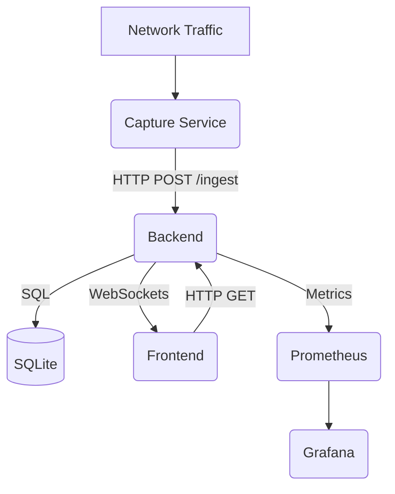

# NetWatch Architecture

NetWatch is a modular Network Intrusion Detection System (NIDS) designed for real-time traffic analysis, anomaly detection, and forensic visualization.

## System Overview

The system is composed of five primary services orchestrated by Docker Compose:

1.  **Capture Service**: Sniffs network traffic, assembles flows, and extracts features.
2.  **Backend**: Orchestrates the detection pipeline, manages state, and streams alerts.
3.  **Frontend**: A React-based dashboard for real-time monitoring.
4.  **Prometheus**: Collects and stores performance metrics.
5.  **Grafana**: Provides a visual observability stack.

## Component Interaction

## Design Choices

### 1. Decoupled Capture & Analysis
The packet capture engine is separated from the detection backend.
- **Why**: Allows the capture service to run with elevated privileges (`NET_ADMIN`) while keeping the backend "unprivileged". It also enables scaling multiple capture nodes reporting to a single central backend.

### 2. Two-Stage Detection Pipeline
The system combines statistical baselining with machine learning.
- **Why**:
    - **Stage 1 (Statistical)** catches volume-based attacks immediately without training.
    - **Stage 2 (ML)** catches sophisticated pattern-based attacks and provides specific classification.
    - This approach provides "Day 0" protection while improving accuracy over time as models are trained.

### 3. Asynchronous I/O (FastAPI & aiosqlite)
The backend is built on FastAPI and uses `aiosqlite`.
- **Why**: Network ingestion is high-frequency. Async I/O allows the backend to handle hundreds of flows per second and multiple concurrent WebSocket clients without blocking.

### 4. SQLite with WAL Mode
Persistence uses SQLite instead of a heavy-duty database like PostgreSQL.
- **Why**: Zero configuration, portable, and extremely fast for the write-heavy workload of an IDS. **Write-Ahead Logging (WAL)** is enabled to allow concurrent reads (for the dashboard/Prometheus) while the ingest process is writing alerts.

### 5. Scapy + Flow Engine
The capture service uses Scapy for packet parsing.
- **Why**: Scapy provides high-level abstractions for complex protocols, making it easy to extend feature extraction. The custom flow engine handles 5-tuple assembly and bidirectional state management.

## Key Patterns

- **Pipeline Pattern**: Flows pass through a linear set of processors (Normalization -> Stage 1 -> Stage 2 -> Combine -> Rate Limit -> Persist -> Broadcast).
- **Publisher/Subscriber**: The capture service uses an internal background queue to publish flows to the backend, ensuring that slow network responses don't drop packets in the sniffer.
- **Singleton Engines**: Components like the `RollingBaseline` and `MLClassifier` are instantiated once and shared across the application lifecycle.
- **React Hooks**: The frontend utilizes custom hooks (`useAlertStream`, `useStats`) to encapsulate complex WebSocket and polling logic.
